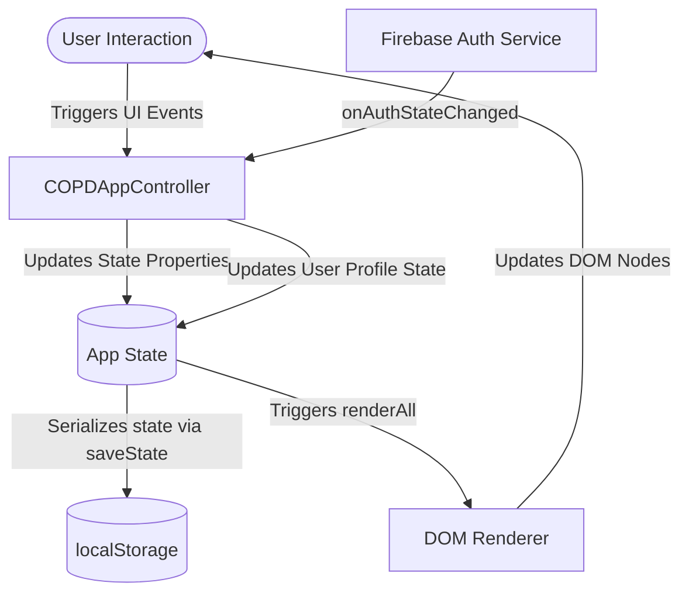
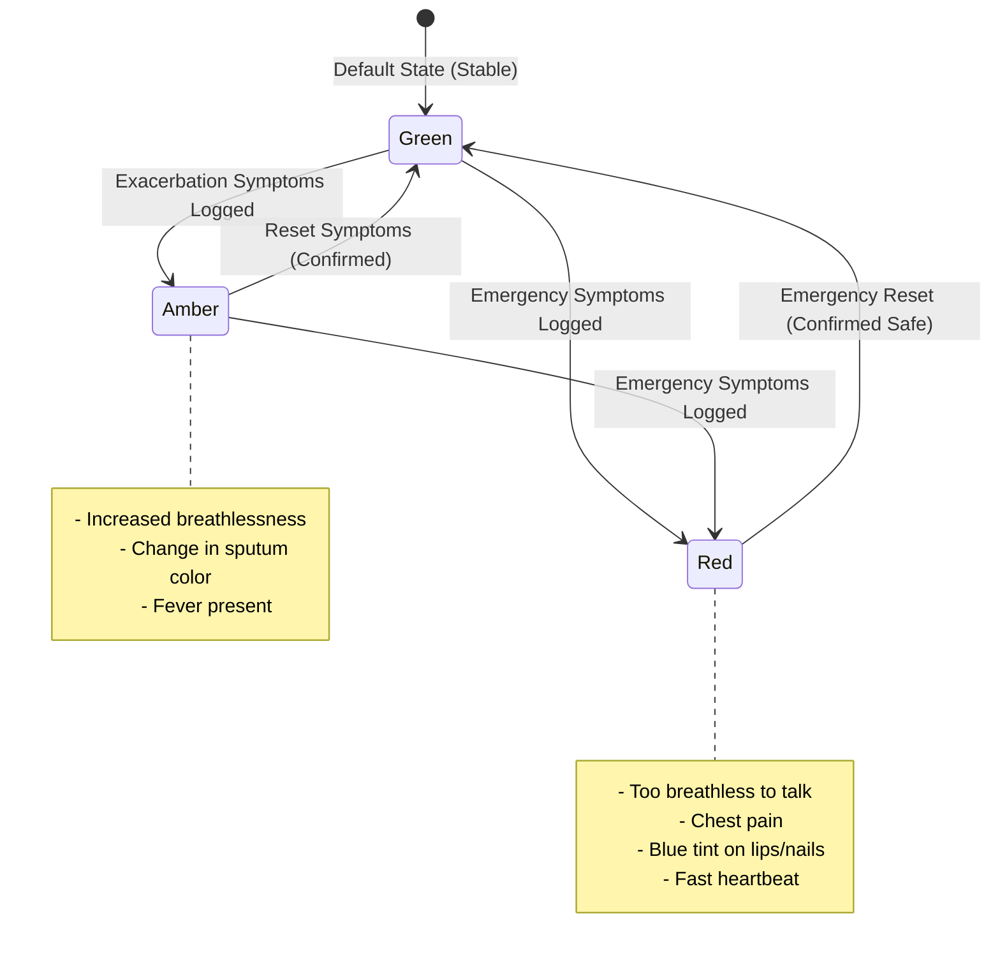

# COPD Action Plan & Care Manager

A premium, accessible, and clinically compliant mobile-first web application designed to help patients monitor and manage Chronic Obstructive Pulmonary Disease (COPD) exacerbations. The application uses a traffic-light zone system (Green, Amber, Red) aligned with standard clinical action plans to deliver visual guidance, preventative tasks, and emergency warnings.

---

## 🏗️ System Architecture

The application is structured as a zero-dependency, highly responsive Single Page Application (SPA). It uses vanilla ES6 JavaScript for logic and state management, coupled with a strict CSS design system calibrated for visual accessibility (WCAG 2.1 AA compliant).

### Data Flow and Rendering Loop
The app follows a unidirectional data flow pattern, using a manual reactivity loop to bind state to the DOM:



### Zone & Clinical State Machine
The core of the logic revolves around the patient's symptomatic zones. The transition boundaries and lockouts follow strict clinical guidelines:



---

## 📊 Application State Schema

All state is managed centrally within the `COPDAppController` class under `this.state` and persisted locally.

| State Path | Type | Description |
| :--- | :--- | :--- |
| `user` | `Object \| null` | Authenticated Firebase User profile details (`uid`, `isAnonymous`, `displayName`, `email`, `photoURL`). |
| `currentZone` | `'green' \| 'amber' \| 'red'` | Current severity status representing the clinical zone. |
| `patientInfo` | `Object` | Basic details (`name`, `address`, `emergencyContactName`, `emergencyContactPhone`, `co2Retainer`). |
| `dailyStatus` | `Object` | Symptoms logging checklists (breathlessness status, cough, mucus color/changes, fever, exercise tolerance, and red flags). |
| `medications` | `Object` | Compliance tracking (maintenance medication, reliever puff counts, rescue pack activation status, steroids/antibiotics doses). |
| `rehabExercises`| `Object` | Pulmonary rehabilitation daily exercise compliance (`completedToday`). |
| `hospitalChecklist`| `Object` | Transition-of-care checklist for patients post-discharge (GP appointments, inhaler techniques, vaccines, advance care planning). |
| `logs` | `Array<Object>` | Ephemeral audit trail of telemetry events and warnings logged during the current day. |

---

## 🔒 Firebase Security & Configuration

The application uses Firebase services to manage user authentication and secure underlying resources.

### 1. Authentication Configuration
Firebase Authentication is enabled in the Firebase console and configured in `firebase.json`.
- **Google Sign-In**: Enables patients to sign in using their Google credentials, auto-filling name and profile data.
- **Anonymous Authentication**: Allows guest access for immediate, low-friction usage while maintaining a persistent session identifier.

### 2. Firestore Security Rules
All read and write access to the Cloud Firestore database is blocked by default since the client application does not store data on remote Firestore collections:
```javascript
rules_version = '2';
service cloud.firestore {
  match /databases/{database}/documents {
    match /{document=**} {
      allow read, write: if false;
    }
  }
}
```

### 3. Cloud Storage Security Rules
Cloud Storage access is restricted to authenticated users. Only requests containing a valid `request.auth` token can read or write assets:
```javascript
rules_version = '2';
service firebase.storage {
  match /b/{bucket}/o {
    match /{allPaths=**} {
      allow read, write: if request.auth != null;
    }
  }
}
```

---

## 🛠️ Developer Setup & Operations

### Prerequisites
Make sure you have [Node.js](https://nodejs.org/) installed. No local node dependencies are required for running the web application, but `firebase-tools` is needed for local simulation and deployment.

### Running the App Locally
1. Start a local HTTP server in the root directory:
   ```bash
   npx -y serve@latest .
   ```
2. Open your browser and navigate to `http://localhost:3000`.

### Validating Firebase Configurations
To dry-run rules, check configurations, and run compilation validation:
```bash
# Verify Firebase configurations and Security Rules compile correctly
npx -y firebase-tools@latest deploy --only firestore:rules,storage --dry-run --project copd-care-manager-53f3
```

### Deploying to Firebase Hosting
To release the code and security rules to production:
```bash
# Deploy all hosting assets and rules
npx -y firebase-tools@latest deploy --project copd-care-manager-53f3
```

---

## ♿ Visual & Accessibility Compliance

The interface strictly conforms to the guidelines defined in the [DESIGN.md](file:///c:/Users/mystg/Documents/copd/DESIGN.md) system:
- **Typography**: Display/headlines are styled with Satoshi; high-density telemetry statistics and metrics are rendered in **JetBrains Mono** for clear diagnostic reading.
- **Target Sizes**: Buttons and interactive controls enforce a minimum touch target size of `48px` to facilitate navigation for users with motor tremors or tactile difficulty.
- **Contrast**: Contrast ratios conform to **WCAG 2.1 AA** specifications across all zones, keeping text readable against light background tints (e.g., Green `#F4F9E4` vs Dark Green `#2A3C00`).
